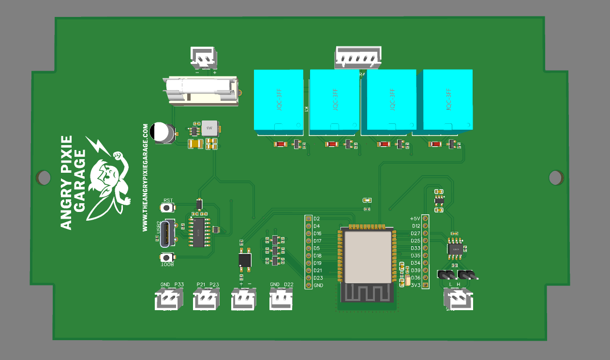

# Angry Pixie UniBoard

ESP32-based vehicle control/interface board that runs the Angry Pixie Dash.
Designed in EasyEDA; fabrication files in this folder are ready for
JLCPCB/LCSC (BOM and pick-and-place reference LCSC part numbers).

## Overview

| Block | Part | Notes |
|-------|------|-------|
| MCU | ESP32-WROOM-32E (4 MB) | WiFi AP + CAN (TWAI) |
| CAN transceiver | TI SN65HVD230DR | 3.3 V, slope control via 10 kΩ on RS |
| CAN termination | 120 Ω (R12) | Selectable with jumpers JP1 + JP2 |
| USB programming | USB-C → CH340C | Auto-reset (MUN5214DW1T1G), RST + BOOT buttons |
| Power input | 12–24 V vehicle supply | PTF-15 fuse holder |
| 5 V rail | AP63205WU buck converter | Feeds relay coils and 5 V header pin |
| 3.3 V rail | AP2112K-3.3 LDO | Feeds ESP32, CAN transceiver |
| Relay outputs | 4× Songle SRD-05VDC-SL-A | MMBT2222A low-side drivers, LL4148 flyback |
| Isolated input | EL357N optocoupler | 2.2 kΩ input resistor, 10 kΩ pull-up to 3V3 |
| Level shifters | 3× BSS138 | Bidirectional 3.3 V ↔ 5 V on GPIO 21/23/33 |

## ESP32 pin map (from schematic)

| GPIO | Function |
|------|----------|
| 25 | **CAN_TX** → SN65HVD230 D |
| 27 | **CAN_RX** ← SN65HVD230 R |
| 26 | Relay 1 |
| 32 | Relay 2 |
| 14 | Relay 3 |
| 13 | Relay 4 |
| 15 | Optocoupler input (CN2) |
| 22 | GPIO on CN3 |
| 21, 23, 33 | Level-shifted 5 V I/O (CN6/CN7) |
| 2, 4, 5, 12, 16, 17, 18, 19, 34, 35, 36, 39 | Broken out on headers H1/H2 |

> Note: CAN_TX = GPIO25 and CAN_RX = GPIO27 per the schematic. This matches
> `leaf_dash_v9.ino`.

## Connectors (JST XH)

| Ref | Pins | Function |
|-----|------|----------|
| CN4 | 2 | Vehicle power in (12–24 V, fused) |
| CN5 | 2 | CAN bus (CANH / CANL) |
| CN1 | 5 | Relay outputs NO1–NO4 + GND |
| CN2 | 2 | Isolated (opto) input |
| CN3 | 2 | GPIO22 + GND |
| CN6 | 2 | Level-shifted GPIO23 / GPIO21 (5 V) |
| CN7 | 2 | Level-shifted GPIO33 (5 V) + GND |
| H1, H2 | 10 each | GPIO breakout headers with 3V3 / 5 V / GND |

## Files

- `Schematic.pdf` — full schematic (2 sheets: main board + CAN/level shifters)
- `Gerbers.zip` — PCB fabrication files
- `BOM.csv` — bill of materials with LCSC part numbers
- `PickAndPlace.csv` — component placement for assembly
- `board-top.png` / `board-bottom.png` — PCB renders
